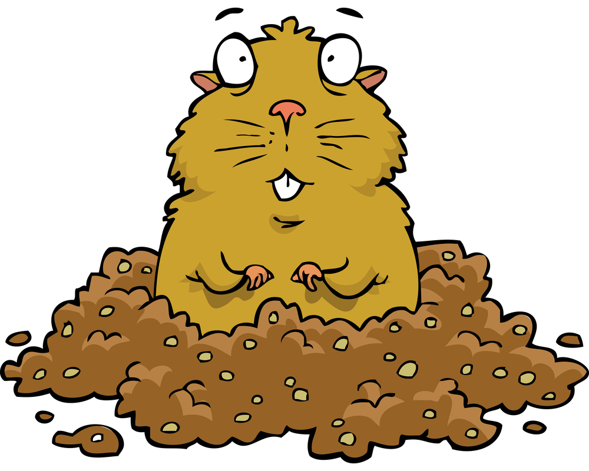

Gollections is a collections library to mimic
[Kotlin's collections](https://kotlinlang.org/api/latest/jvm/stdlib/kotlin.collections/-collection/)

Plan is to define a complete and well tested collection framework, so that we can update the fake `T` struct to use actual parameter types once Golang introduce support for generics
(planned for 1.18)
